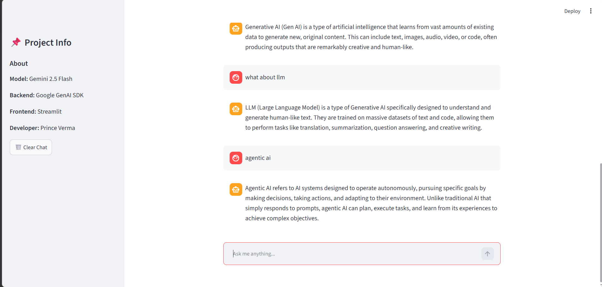

# 🤖 AI Chat Assistant

A Streamlit-based AI Chat Assistant powered by Google's Gemini API. Users can interact with the chatbot through a clean web interface, maintain conversation history, and receive intelligent responses in real time.

---

# Tech Stack

- **Frontend:** Streamlit
- **Backend:** Python
- **LLM:** Google Gemini 2.5 Flash
- **Environment Management:** python-dotenv

---

# Project Structure

```
week-1-ai-chat-assistant/
│
├── Frontend.py          # Streamlit User Interface
├── chat.py              # Backend (Gemini API Integration)
├── .env.example         # Example environment variables
├── requirements.txt     # Project dependencies
├── .gitignore
└── README.md
```

---

# Features

- AI-powered conversational chatbot
- Google Gemini API integration
- Conversation memory
- Interactive Streamlit chat interface
- Error handling

---

# Prerequisites

- Python 3.10+
- Google Gemini API Key
- pip

---

# Installation

## 1. Clone Repository

```bash
git clone https://github.com/princeVerma73/week-1-ai-chat-assistant.git

cd week-1-ai-chat-assistant
```

---

## 2. Create Virtual Environment

```bash
python -m venv venv
```

### Windows

```bash
venv\Scripts\activate
```

### macOS/Linux

```bash
source venv/bin/activate
```

---

## 3. Install Dependencies

```bash
pip install -r requirements.txt
```

---

## 4. Configure Environment Variables

Create a `.env` file.

```env
GEMINI_API_KEY=YOUR_API_KEY
```

You can generate a Gemini API key from **Google AI Studio**.

---

# Run the Application

```bash
streamlit run Frontend.py
```

Open:

```
http://localhost:8501
```

---

# Application Workflow

```
User
   │
   ▼
Streamlit Frontend
   │
   ▼
Backend (chat.py)
   │
   ▼
Google Gemini API
   │
   ▼
AI Response
```
---

# Conversation Flow
1. User enters a prompt.
2. Frontend stores chat history using `st.session_state`.
3. Complete conversation is sent to the backend.
4. Backend formats the conversation.
5. Gemini generates a response.
6. Response is displayed and stored in chat history.
---

# Environment Variables

| Variable | Description |
|----------|-------------|
| GEMINI_API_KEY | Google Gemini API Key |

---

## Application Preview



---

# Future Improvements
- Deploy on Streamlit Community Cloud
- Gemini Chat Session API
- Streaming Responses
- File Upload Support
- Voice Input
- Multiple LLM Support

---

# Developer

**Prince Verma**

B.Tech Computer Science & Engineering

IIIT Bhagalpur

GitHub:
https://github.com/princeVerma73

---

## License

This project is developed for learning purposes as part of the **DStarix Generative AI Internship (Week 1)**.
